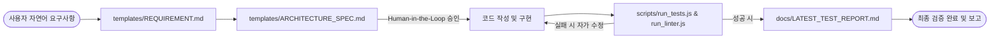

# No-Coding SDLC 자동화 프레임워크 시스템 디자인 (System Design)

본 문서는 사용자의 요구사항 정의부터 최종 검증까지의 소프트웨어 개발 수명 주기(SDLC)를 AI 에이전트가 주도하여 자동화하는 프레임워크의 동작 구조와 핵심 규칙을 기술합니다.

---

## 1. 프레임워크 동작 아키텍처
프레임워크는 **상태 정의 템플릿(templates/)**, **에이전트 제어 정책(.agents/)**, **자동화된 실행 환경(scripts/)**의 3가지 결합으로 동작합니다.

---

## 2. 프레임워크 핵심 제어 원리

### 1) Human-in-the-Loop (인간 승인 기반 제어)
에이전트가 단독으로 코드를 대량 생성하여 발생할 수 있는 환각(Hallucination) 및 비용 낭비를 차단하기 위해, 요구사항 분석 단계와 아키텍처 설계 단계가 끝난 시점에 **사용자의 승인**을 받도록 설계되어 있습니다.
* 에이전트는 계획 단계를 마친 후 대화를 정지하고 사용자의 승인 피드백(Proceed 버튼 등)을 기다립니다.

### 2) 자가 치유 루프 (Self-Healing Debugging)
구현된 코드의 신뢰성을 담보하기 위한 핵심 매커니즘입니다.
1. 에이전트가 구현을 완료하면 `node scripts/run_tests.js`를 백그라운드 터미널에서 자동 구동합니다.
2. 실패한 테스트 케이스가 존재하거나 런타임 오류가 발생하면, 스크립트는 종료 코드 `1`을 리턴하며 오류 스택 트레이스를 `docs/LATEST_TEST_REPORT.md`에 정형화하여 기록합니다.
3. 에이전트는 이 로그 파일을 읽어 오류의 원인을 분석한 후, 관련 코딩 파일을 수정하고 다시 검증 스크립트를 돌립니다.
4. 모든 검사 코드가 정상적으로 통과(`exit code 0`)될 때까지 에이전트는 이 자가 수정을 반복합니다.

---

## 3. 에이전트 규칙 (.agents/AGENTS.md)
에이전트는 이 워크스페이스를 시작할 때 규칙을 최우선적으로 학습하여 요구사항 명세화 및 계획 수립, 그리고 테스트 기반의 개발 프로세스를 강제당합니다.
이를 통해 개발 프로세스 표준이 완벽히 유지됩니다.
