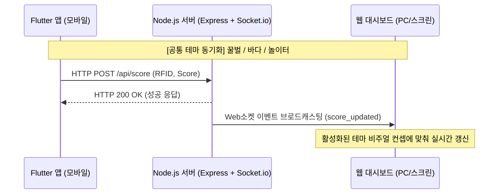

# 아키텍처 및 구현 계획서 (Architecture & Implementation Spec) - 1단계 (공통 다중 테마)

* **작성 에이전트**: Antigravity
* **최종 업데이트**: 2026-06-23
* **참조 요구사항**: [Requirement Spec](file:///c:/Users/user/OneDrive/문서/antigravity/rfid_score_system/templates/REQUIREMENT.md)

---

## 1. 아키텍처 개요 (System Architecture)

본 시스템은 **Flutter 모바일 앱**(점수 입력), **Node.js 서버**(중개 및 데이터 처리), **다중 테마형 웹 대시보드**(실시간 스코어보드 시각화)의 3-Tier 아키텍처로 구성됩니다. 모바일과 웹은 **색상 팔레트와 캐릭터 일러스트를 동기화**하여 일관된 브랜드 경험을 구현합니다.



---

## 2. 파일 및 디렉토리 구조 (Directory Structure)

```text
rfid_score_system/
├── backend/                  # 백엔드 서버 모듈
│   ├── src/
│   │   ├── server.js         # API 서버 및 소켓 서버 메인
│   │   ├── db.js             # SQLite / JSON 데이터베이스 모듈
│   │   └── routes.js         # REST API 라우터
│   └── package.json          # 백엔드 의존성
├── frontend/                 # 웹 대시보드 (다중 테마형 Vanilla Web)
│   ├── index.html            # 스코어보드 대시보드 UI
│   ├── style.css             # CSS Variables 기반 핵심 레이아웃
│   ├── theme.css             # 테마별 CSS 변수 및 애니메이션 스타일
│   └── app.js                # WebSocket 클라이언트 및 테마 제어 로직
├── mobile/                   # Flutter 모바일 프로젝트
│   ├── lib/
│   │   ├── main.dart         # Flutter 엔트리 포인트 (ThemeData 설정 포함)
│   │   ├── themes/
│   │   │   └── app_themes.dart  # [신규] Flutter용 공통 테마 정의서 (Honeybee, Ocean, Kids)
│   │   ├── screens/
│   │   │   └── score_input.dart # 점수 부여, 테마 체인저, 가상 NFC 입력 화면
│   │   └── services/
│   │   │   └── api_service.dart # 백엔드 API 연동 모듈
│   └── pubspec.yaml          # Flutter 패키지 설정
└── templates/                # SDLC 템플릿 폴더
```

---

## 3. 웹 및 모바일 테마 동기화 및 모듈화 설계

### 3.1. 웹 대시보드 (CSS Variables)
* `style.css`와 `theme.css`를 통해 클래스명 스위칭(`.theme-honeybee`, `.theme-ocean`, `.theme-kids`) 방식으로 테마를 즉각 적용합니다.

### 3.2. Flutter 모바일 앱 (ThemeData & Custom Themes)
* `mobile/lib/themes/app_themes.dart` 내에 테마별 `ThemeData`와 커스텀 마스코트/배경 이미지를 정의합니다.
* **디자인 파라미터 매핑**:

| 테마 ID | 컨셉명 | 웹 기본 색상 | 모바일 Primary Color (ARGB) | 핵심 일러스트/아이콘 |
| :--- | :--- | :--- | :--- | :--- |
| **honeybee** | 귀여운 꿀벌 | `#f5b041` (Yellow) | `0xFFF5B041` | 벌집 아이콘, 날아다니는 벌 |
| **ocean** | 시원한 바다 | `#2980b9` (Blue) | `0xFF2980B9` | 파도 물결, 물방울, 돌고래 |
| **kids** | 놀이터 | `#ec7063` (Coral/Red)| `0xFFEC7063` | 풍선, 놀이터 일러스트, 별 |

* **모바일 테마 제어**:
  * Flutter 앱 내 `score_input.dart` 상단에 테마 선택 세그먼트/아이콘 버튼 배치.
  * 테마 선택 시 전역 `ThemeData`가 실시간 반영(setState / ValueNotifier 활용)되어 웹 대시보드와 비주얼 정렬 유지.

---

## 4. 검증 전략 (Verification Strategy)
* **모바일 테마 검증**: Flutter 앱 내에서 테마 토글 버튼을 작동했을 때, 전체 스크린 색상, 버튼 라벨, 아이콘 이미지 리소스들이 지정된 테마 디자인 파라미터에 어긋남 없이 동적으로 일체감 있게 갱신되는지 시각적으로 체크합니다.
* **실시간 대시보드 연동**: 모바일 테마와 웹 대시보드 테마가 일치된 상황에서 테스트 스캔을 유도하여, 스캔 전후의 비주얼 일체감이 유지되는지 확인합니다.
